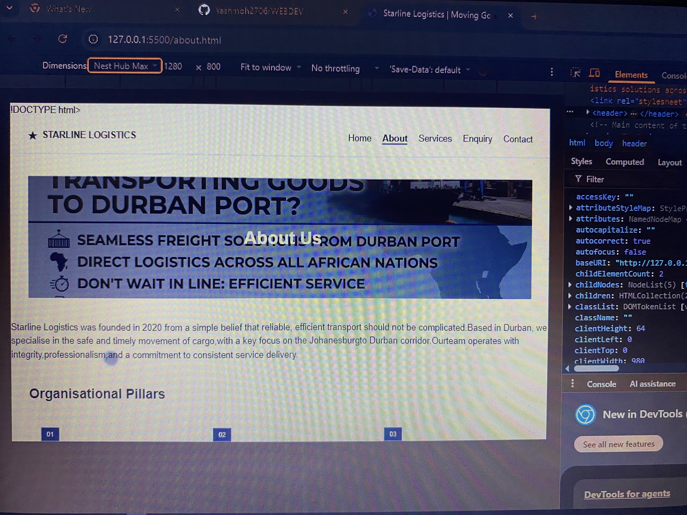
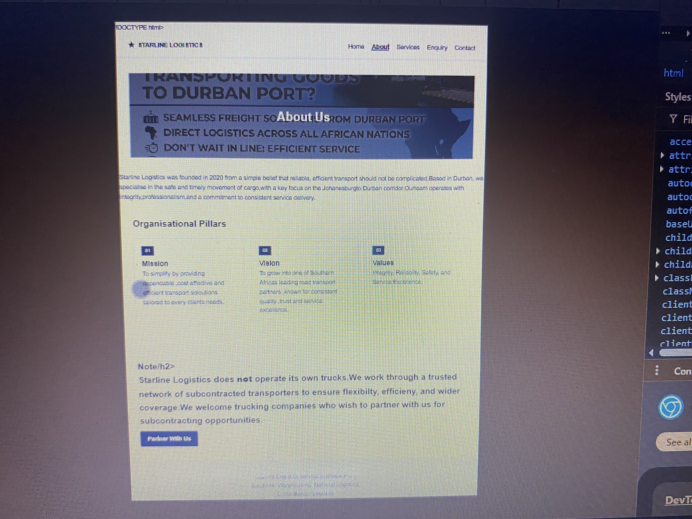
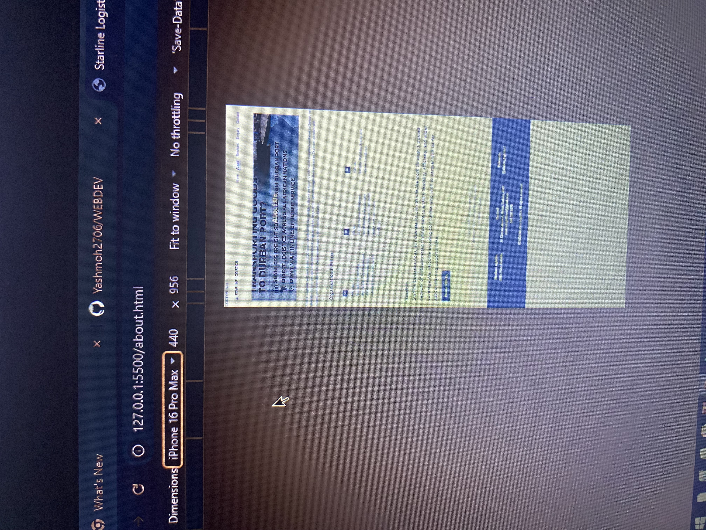

# Starline Logistics — Website Development Project

## Project Title
Starline Logistics Website — WEDE5020 Web Development (Introduction) POE

## Student Information
- **Name:** Yashfeen
- **Student Number:** [Insert Student Number]
- **Module:** WEDE5020 — Web Development (Introduction)
- **Institution:** The IIE Rosebank College

## Project Overview
Starline Logistics is a Durban-based road transport and freight company, established in 2020. The business specialises in local, national, and cross-border logistics, moving general cargo, refrigerated goods, and containers through a trusted network of subcontracted transporters, with a key operational focus on the Johannesburg–Durban corridor.

This project involves designing and developing a professional, functional website for Starline Logistics — currently a business with **no existing online presence** — to help the company generate enquiries, build credibility with potential clients, and attract trucking companies interested in subcontracting partnerships.

The project follows a three-part structure:
- **Part 1:** Planning, research, sitemap, wireframes, and foundational HTML structure (current phase)
- **Part 2:** CSS styling and responsive design
- **Part 3:** JavaScript functionality and SEO optimisation

## Website Goals and Objectives
- Generate enquiries from businesses needing freight and cargo transport
- Attract trucking companies interested in subcontracting partnerships
- Build credibility and trust through a professional online presence
- Provide clear, accessible information on services, coverage, and contact details

**Key Performance Indicators (KPIs):**
- Number of enquiry form submissions per month
- Increase in direct (non-referral) client contact
- Time visitors spend on the Services page

## Key Features and Functionality
- **Homepage (`index.html`):** Hero banner, company introduction, service highlights, call-to-action
- **About Us (`about.html`):** Company history, mission/vision/values, subcontracted fleet model
- **Services (`services.html`):** Full breakdown of core services and additional capabilities
- **Enquiry (`enquiry.html`):** Form for freight quotes and subcontracting partnership enquiries
- **Contact (`contact.html`):** Contact details, embedded maps (Durban Head Office + Johannesburg route hub), contact form
- Semantic HTML structure (`header`, `nav`, `main`, `section`, `footer`) across all pages
- Consistent navigation linking all 5 pages

## Timeline and Milestones

| Task | Owner | Start Date | End Date | Status |
|---|---|---|---|---|
| Selected target organisation (ICE Task 1) | Yashfeen | 05 Aug 2026 | 07 Aug 2026 | Completed |
| Created Website Project Proposal (ICE Task 2) | Yashfeen | 08 Aug 2026 | 12 Aug 2026 | Completed |
| Created sitemap and wireframes | Yashfeen | 11 Aug 2026 | 11 Aug 2026 | Completed |
| Built homepage (index.html) | Yashfeen | 11 Aug 2026 | 11 Aug 2026 | Completed |
| Built remaining HTML pages (about, services, enquiry, contact) | Yashfeen | 18 Aug 2026 | 22 Aug 2026 | Ongoing |
| CSS styling and responsive design (Part 2) | Yashfeen | 23 Aug 2026 | 05 Sep 2026 | Not Started |
| JavaScript functionality and SEO (Part 3) | Yashfeen | 06 Sep 2026 | 19 Sep 2026 | Not Started |

## Part 1 Details
Part 1 covers project initiation and planning, including:
- Target organisation research and selection (Starline Logistics)
- Website Project Proposal (goals, features, design direction, budget)
- Content research and sourcing (company profile, client-supplied promotional material, sourced photography)
- Sitemap and low-fidelity wireframes for all 5 pages
- File and folder structure setup (`css/`, `js/`, `images/`)
- Semantic HTML structure and basic content for all 5 pages

*Part 2 (CSS styling and responsive design) and Part 3 (JavaScript functionality and SEO) will follow in future submissions/edits.*

## Sitemap

```
Homepage (index.html)
|
┌───────────┬────────┼────────┬────────────┐
About Us Services Enquiry Contact
(about.html)(services.html)(enquiry.html)(contact.html)
```

All four pages are linked directly from the homepage via the main navigation menu, and the navigation is consistent across all 5 pages.

## Changelog

| Date | Change |
|---|---|
| 07 Aug 2026 | Selected Starline Logistics as target organisation (ICE Task 1) |
| 12 Aug 2026 | Completed and submitted Website Project Proposal (ICE Task 2) |
| 11 Aug 2026 | Created sitemap and wireframes for all 5 pages |
| 11 Aug 2026 | Built homepage (index.html) with hero, intro, and service highlight sections |
| 18 Aug 2026 | Built about.html, services.html, enquiry.html, and contact.html |
| 18 Aug 2026 | Added client-supplied promotional images (service badge, cross-border and Durban Port flyers) to About and Services pages |
| 18 Aug 2026 | Fixed image path errors (missing `images/` folder reference) across all pages |
| 24 Sep 2026 | Began part 2- CSS styling and responsive design |
| 25 Sep 2026 | Created external stylesheet (style.css) and linking to all 5 pages |

## References
- Starline Logistics (2026) *Company Profile*. [PDF]. Durban: Starline Logistics.
- Starline Logistics (2026) Promotional materials supplied by client (service overview graphic, Durban Port and cross-border expertise flyers).
- Pexels (2026) *Truck traveling a highway*. Available at: https://www.pexels.com/photo/truck-traveling-a-highway-14005602/ (Accessed: August 2026).
- Pexels (2026) *Trucks and cars on a highway*. Available at: https://www.pexels.com/photo/trucks-and-cars-on-a-highway-16325212/ (Accessed: August 2026).
- Pexels (2026) *Cargo container lot*. Available at: https://www.pexels.com/photo/cargo-container-lot-906494/ (Accessed: August 2026).

## Responsive Design Testing 

**Desktop View:**


**Tablet View:**


**Mobile View:**

